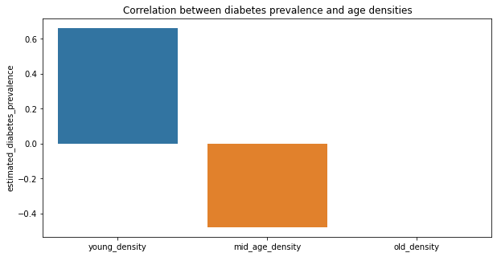

# DiHabitIs,  a data story made by ShareLoc

In a [study](https://www.ncbi.nlm.nih.gov/pmc/articles/PMC7029018/) analyzing a record of 420M food items purchased at Tesco in greater London, researchers identified nutrients that were highly correlated with diabetes. 

We, ShareLoc, would like to dig further in this dataset and look if other factors correlate with diabetes risk. 
Note that purchases have been grouped into areas, meaning that we can not perform analysis on individuals, but rather have information about the general tendencies in a specific area.  

## Age study (make this title fun)

Our first step is to differentiate areas by age. We have access to three groups of age : 
- young : 0 to 17 years
- adult : 18 to 64 years
- old   : 65+ years

We computed the age densities of each population (e.g young_density = #young/total_population) and hereby plot the correlations between the age densities and diabets prevalence : we only took into account correlations having a p-value < 0.05

**Surprising !** The younger the population, the higher its diabetes prevalence score. Older population tend not to be affected though. So what do younger areas like so much that adults don't like ? 





# Part on Net Income and local authorities
Do not hesitate to use the wonderful built in zoom tool that you can find on the top right !


Income classes (the Local authorities represent a great territory, hence a slight difference is still meaningful) 

